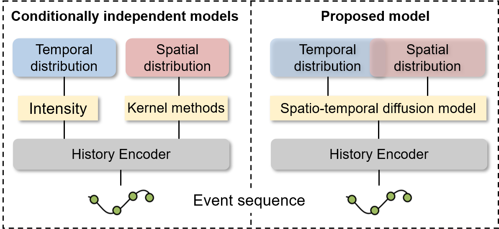

# Spatio-temporal Diffusion Point Processes



This project was initially described in the full research track paper *[Spatio-temporal Diffusion Point Processes](https://github.com/tsinghua-fib-lab/Spatio-temporal-Diffusion-Point-Processes/blob/main/paper/Spatio_temporal_Diffusion_Point_Processes.pdf) at KDD 2023 in Long Beach, CA. Contributors to this project are from the *[Future Intelligence laB (FIB)](https://fi.ee.tsinghua.edu.cn/)* at *[Tsinghua University](https://www.tsinghua.edu.cn/en/)*.

The code is tested under a Linux desktop with torch 1.7 and Python 3.7.10.

## Installation

### Environment
- Tested OS: Linux
- Python >= 3.7
- PyTorch == 1.7.1
- Tensorboard

### Dependencies
1. Install PyTorch 1.7.1 with the correct CUDA version.
2. Use the ``pip install -r requirements. txt`` command to install all of the Python modules and packages used in this project.

## Model Training

Use the following command to train DSTPP on `Earthquake` dataset: 

``
python app.py --dataset Earthquake --mode train --timesteps 200 --samplingsteps 200 --batch_size 64 --total_epochs 2000
``

To train DSTPP on other datasets:

``
python app.py --dataset COVID19 --mode train --timesteps 200 --samplingsteps 200 --batch_size 64 --total_epochs 2000
``

``
python app.py --dataset Pinwheel --mode train --timesteps 200 --samplingsteps 200 --batch_size 256 --total_epochs 2000 
``

``
python app.py --dataset HawkesGMM --mode train --timesteps 200 --samplingsteps 200 --batch_size 256 --total_epochs 2000
``

``
python app.py --dataset Mobility --mode train --timesteps 200 --samplingsteps 200 --batch_size 128 --total_epochs 2000 
``

``
python app.py --dataset Citibike --mode train --timesteps 200 --samplingsteps 200 --batch_size 128 --total_epochs 2000 
``

``
python app.py --dataset Independent --mode train --timesteps 200 --samplingsteps 200 --batch_size 128 --total_epochs 2000 
``

The trained models are saved in ``ModelSave/``.

The logs are saved in ``logs/``.


## Note

The implemention is based on *[DDPM](https://github.com/lucidrains/denoising-diffusion-pytorch)*.

If you found this library useful in your research, please consider citing:

```
Coming soon...
```
